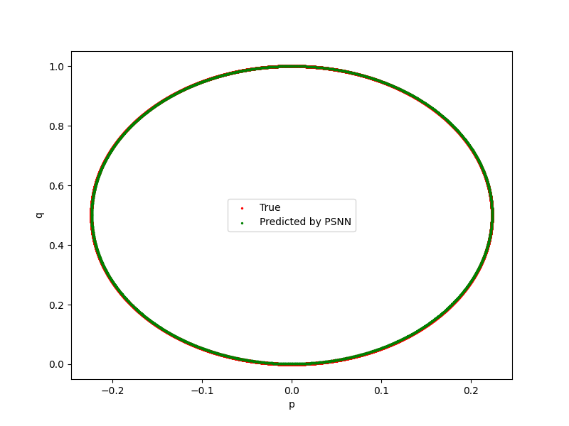
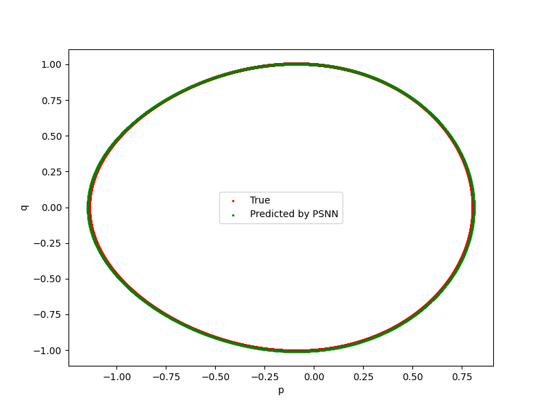
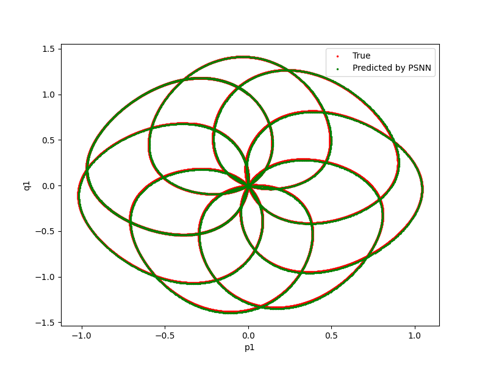

# Pseudo-Symplectic Neural Network

This repository contains the PyTorch implementation of the paper:

**Learning non-separable Hamiltonian systems with pseudo-symplectic neural network**

## Requirements

Install dependencies via:

```bash
pip install torch numpy matplotlib h5py
```

## Train the model for Example 1:

```bash
python ex_1.py
```

# Numerical Results

<h2>Example 1</h2>



<h2>Example 2</h2>



<h2>Example 3</h2>


